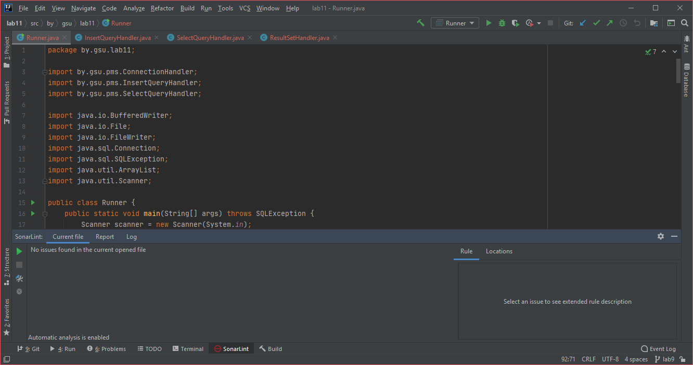
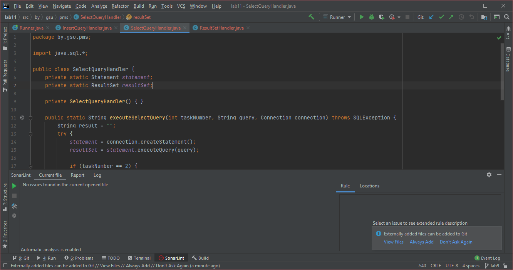
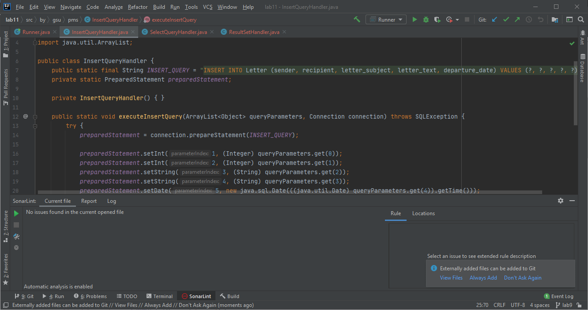
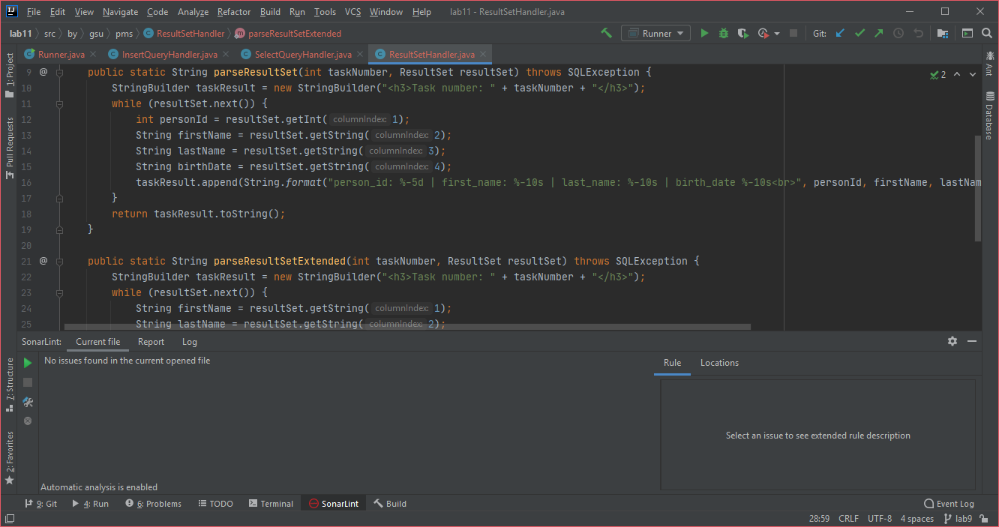
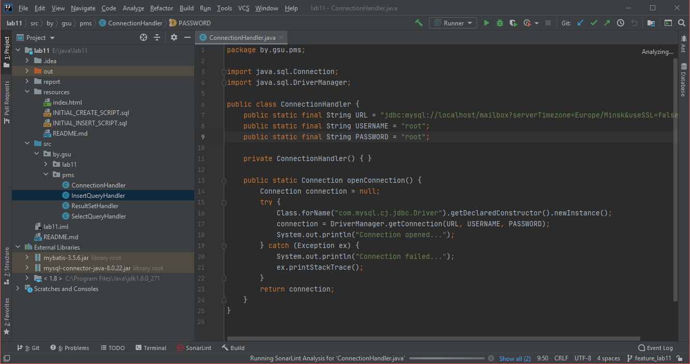

# Лабораторная работа №11

## Подключение и осуществление SQL запросов средствами языка Java
***Задание:*** Вариант №4

### Отчеты SonarLint:
1.  Проверка файла Runner.java показала отсутствие ошибок:
    

2.  Проверка файла SelectQueryHandler.java показала отсутствие ошибок:
    

3.  Проверка файла InsertQueryHandler.java показала отсутствие ошибок:
    

4.  Проверка файла ResultSetHandler.java показала отсутствие ошибок:
    

5.  Проверка файла ConnectionHandler.java показала отсутствие ошибок:
    
