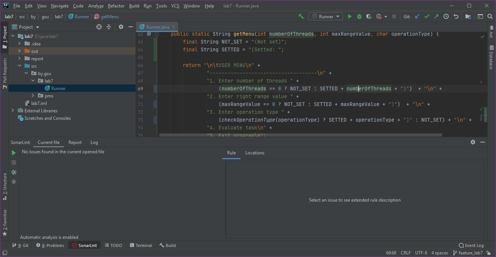

# Лабораторная работа #7

## Многопоточность

Вариант №4
***Задание:*** Вычислить сумму простых чисел от 1 до а, где а – число, вводимое пользователем.

### Отчеты SonarLint:
1.  Первая проверка файла Runner.java:
    

    Вторая проверка файла Runner.java после исправления ошибок:
    

2.  Первая проверка файла CalculatorThread.java показала отсутствие ошибок:
    

3.  Первая проверка файла ThreadGenerator.java:
    

    Вторая проверка файла ThreadGenerator.java после исправления ошибок:
    
