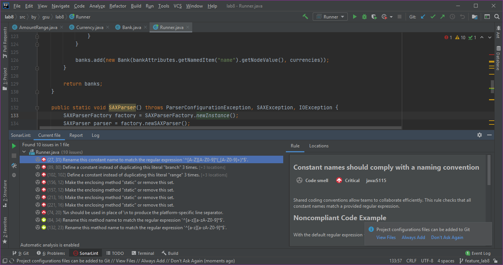
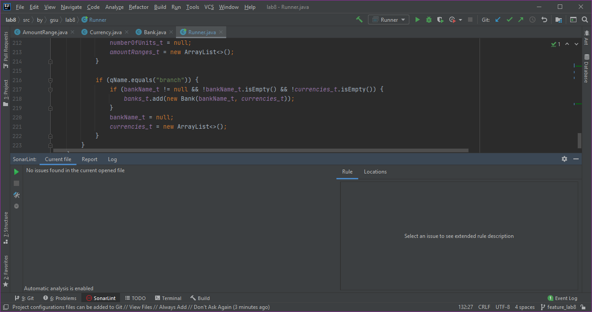
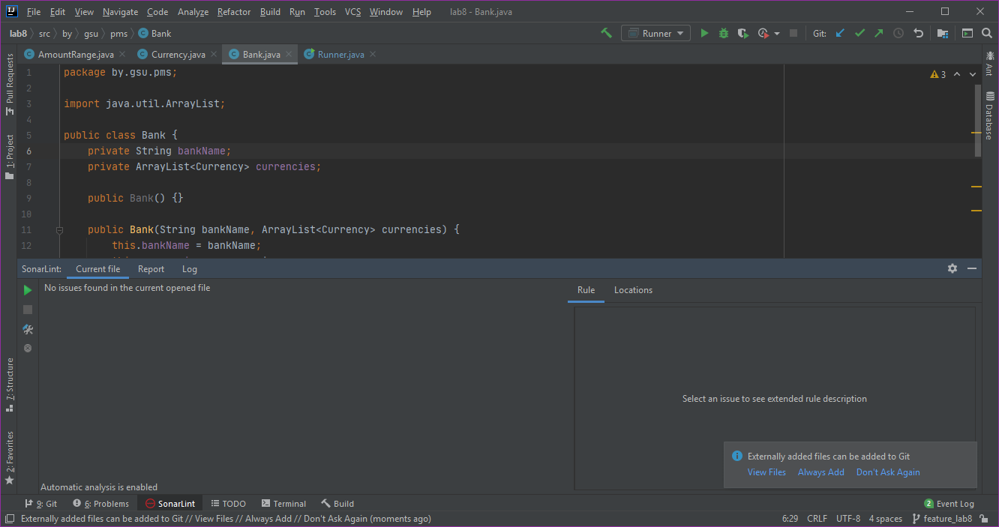
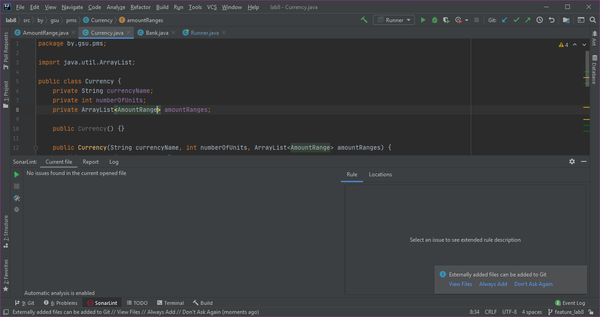
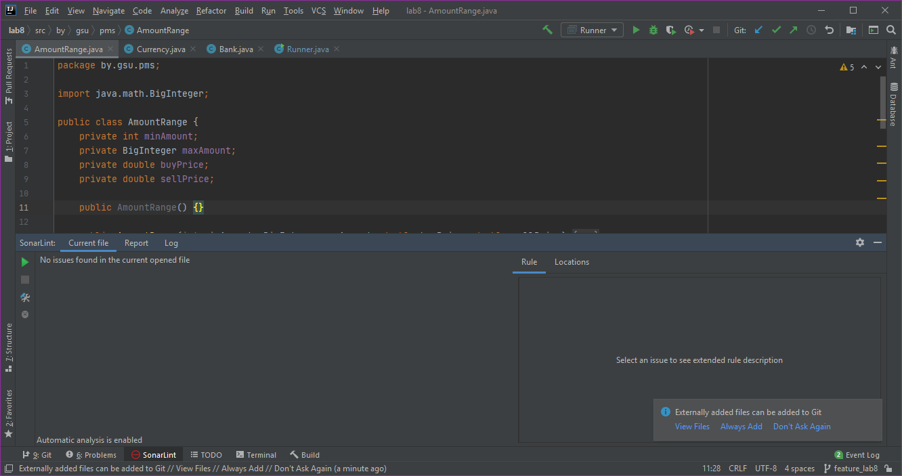

# Лабораторная работа №8

## Обход и обработка XML разметки средствами языка Java
***Задание:*** [вариант №4](http://belgazprombank.by/export_courses.php)

### Отчеты SonarLint:
1.  Первая проверка файла Runner.java:
    

    Вторая проверка файла Runner.java после исправления ошибок:
    

2.  Первая проверка файла Bank.java показала отсутствие ошибок:
    

3.  Первая проверка файла Currency_check.java показала отсутствие ошибок:
    

4.  Первая проверка файла AmountRange.java показала отсутствие ошибок:
    