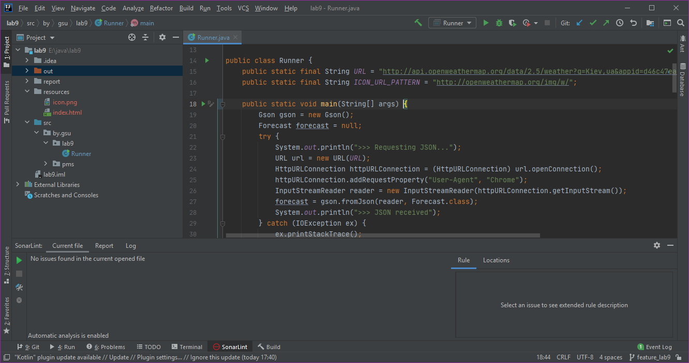
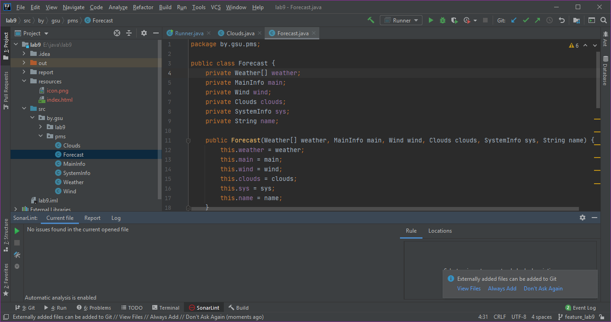
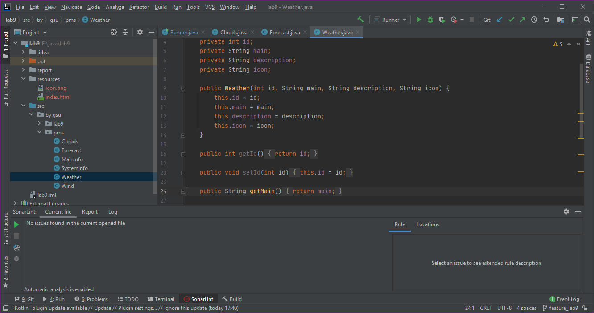
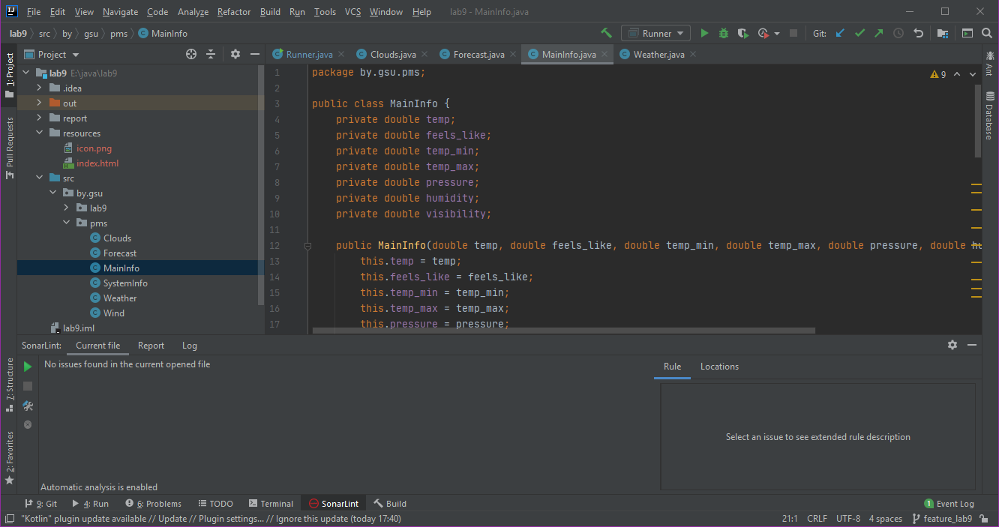
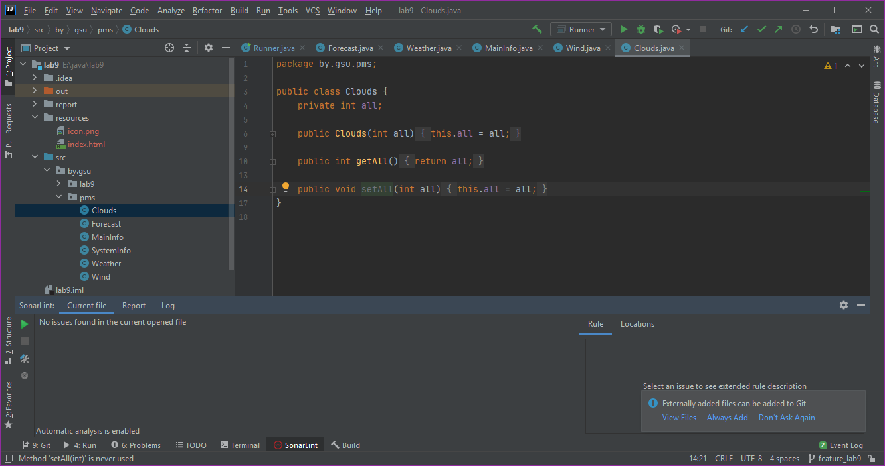
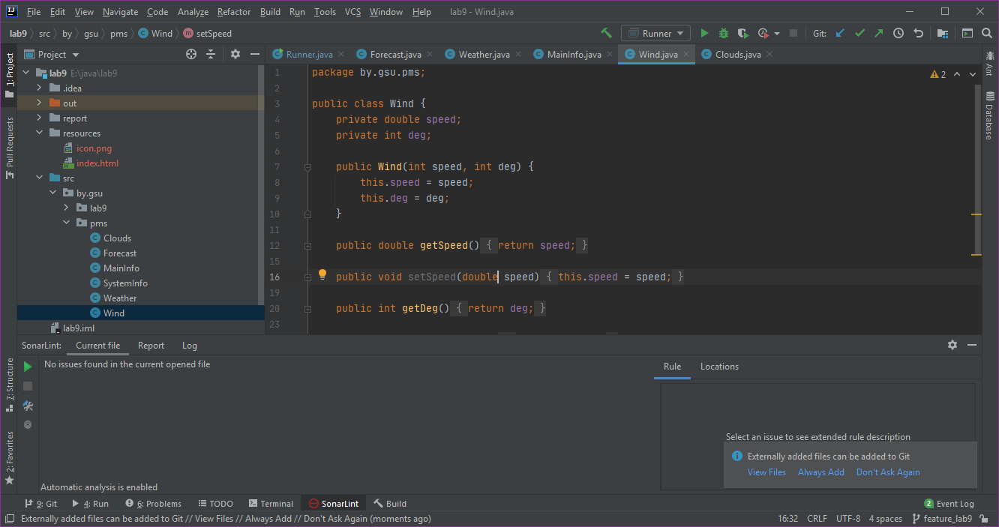
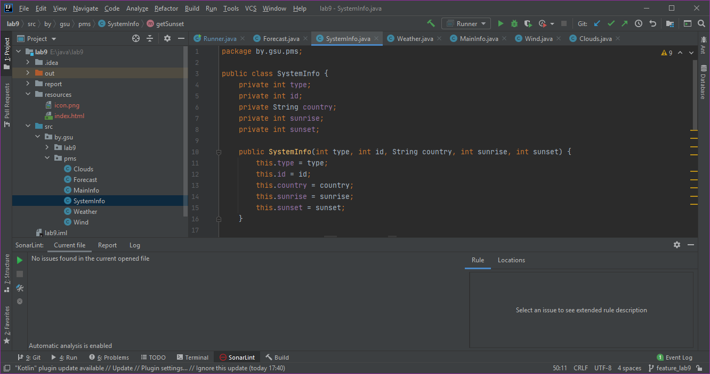

# Лабораторная работа №9

## Парсинг JSON-объектов и работа с HTML разметкой средствами языка Java
***Задание:*** [ссылка содержащая API запрос прогноза погоды по городу Kiev, UA](http://api.openweathermap.org/data/2.5/weather?q=Kiev,ua&appid=d46c47eac54879f975bcbe5c18c24353&units=metric)

### Отчеты SonarLint:
1.  Проверка файла Runner.java показала отсутствие ошибок:
    

2.  Проверка файла Forecast.java показала отсутствие ошибок:
    

3.  Проверка файла Weather_check.java показала отсутствие ошибок:
    

4.  Проверка файла MainInfo.java показала отсутствие ошибок:
    

5.  Проверка файла Clouds.java показала отсутствие ошибок:
    

6.  Проверка файла Wind.java показала отсутствие ошибок:
    

6.  Проверка файла SystemInfo.java показала отсутствие ошибок:
    